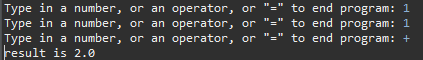

The way this program works is it defines a StackCalculator class, orchestrating a calculator that operates using a stack-based approach. The class employs a StackInterface<Double> to manage stack operations, allowing for pushing values, peeking the top value, and executing arithmetic operations based on the provided operator. The main method initializes the calculator and sets up a scanner to accept user input, processing it within a loop. Numeric entries are pushed onto the stack, and operators like addition, subtraction, multiplication, division, and modulus are handled by popping the necessary operands from the stack and performing the respective operation. The program ends upon receiving the "=" operator. Additionally, a method named isNumeric is provided to determine whether a given string represents a numeric value using regular expression matching. Overall, the program enables users to input numbers and operators to perform arithmetic calculations, utilizing a stack to manage the computations and display the results.

Here is an example of it in use: 

